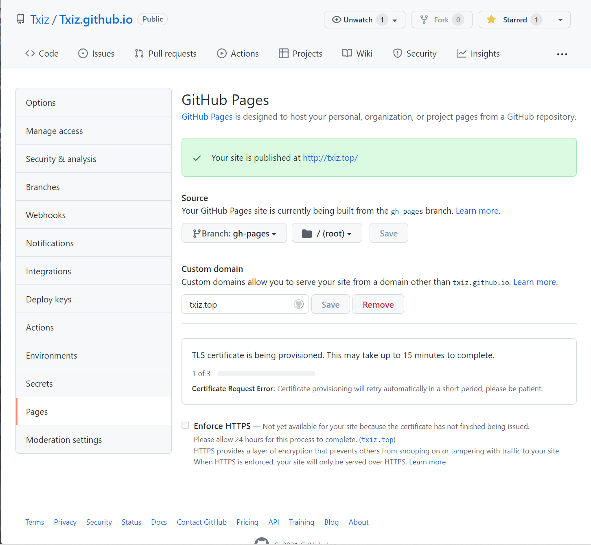

本站点是使用 Facebook 开源的 [Docusaurus](https://www.docusaurus.cn/docs/) 构建的。

🧐 [Docusaurus](https://www.docusaurus.cn/docs/) 是一个静态网站生成器。它发挥了 [React](https://reactjs.org/) 的全部功能来构建具有快速客户端导航的单页应用，从而赋予你的网站交互性。它提供了开箱即用的文档功能，还能用于创建任何类型的网站（例如个人网站、产品介绍、博客、营销页等等）。

🎯 本站点部署在 Github Pages 的免费服务器上，使用 Github Actions 自动部署，并且使用 Cloudflare 进行免费的 CDN 加速。

## **搭建步骤**

要求系统上有 Node.js 可以使用 `npm -v` 命令检查计算机上是否安装了 Node 环境。

然后使用如下命令构建一个最基本的脚手架项目。

```npm
npx create-docusaurus@latest [name] [template]
```

例如：使用 classic 预设（经典默认预设）创建一个项目，项目名称是 website。

```npm
npx create-docusaurus@latest website classic
```

详细步骤可以参考 [Docusaurus](https://www.docusaurus.cn/docs/) 官方文档。

### 如何实现 Github Actions 自动部署

根据预设创建好的项目大概是这么一个基本的目录结构。

```javascript
website
├── blog
│   ├── 2019-05-28-hola.md
│   ├── 2019-05-29-hello-world.md
│   └── 2020-05-30-welcome.md
├── docs
│   ├── doc1.md
│   ├── doc2.md
│   ├── doc3.md
│   └── mdx.md
├── src
│   ├── css
│   │   └── custom.css
│   └── pages
│       ├── styles.module.css
│       └── index.js
├── static
│   └── img
├── docusaurus.config.js
├── package.json
├── package-lock.json
├── README.md
└── sidebars.js
```

我一般使用 VSCode 来编写博客，VSCode 具有源代码管理功能，首先需要自己的 Github 账户，然后创建一个项目仓库，我的仓库名是 Txiz.github.io，然后将本地的文件推送上去。

要想使用 Github Actions，其实非常简单，只需要在 website 目录下创建 ./.github/workflows/deploy.yml 文件即可，新的目录结构如下。

```javascript
website
|── .github
|   └── workflows
|       └── deploy.yml
├── blog
│   ├── 2019-05-28-hola.md
│   ├── 2019-05-29-hello-world.md
│   └── 2020-05-30-welcome.md
├── docs
│   ├── doc1.md
│   ├── doc2.md
│   ├── doc3.md
│   └── mdx.md
├── src
│   ├── css
│   │   └── custom.css
│   └── pages
│       ├── styles.module.css
│       └── index.js
├── static
│   └── img
├── docusaurus.config.js
├── package.json
├── package-lock.json
├── README.md
└── sidebars.js
```

关于 Github Actions 的配置文件，可以直接复制下面的代码，只需要修改两个地方，也就是 user_name 和 user_email，改成自己的就行。

```yaml
name: Deploy to GitHub Pages

on:
  push:
    branches: [main]

jobs:
  deploy:
    name: Deploy to GitHub Pages
    runs-on: ubuntu-latest
    steps:
      - uses: actions/checkout@v2
      - uses: actions/setup-node@v2
        with:
          node-version: 14.x
          cache: npm
      - name: Build static file
        run: |
          npm install
          npm run build
      - name: Deploy to gh-pages branch
        uses: peaceiris/actions-gh-pages@v3
        with:
          github_token: ${{ secrets.GITHUB_TOKEN }}
          publish_dir: ./build
          user_name: Txiz[bot]
          user_email: xiongzhaoxi@qq.com
```

将新的文件再次推送到 Github 仓库，就可以实现自动部署了。以后每次推送内容给仓库的时候都会自动部署。

### 开启 Github Pages

